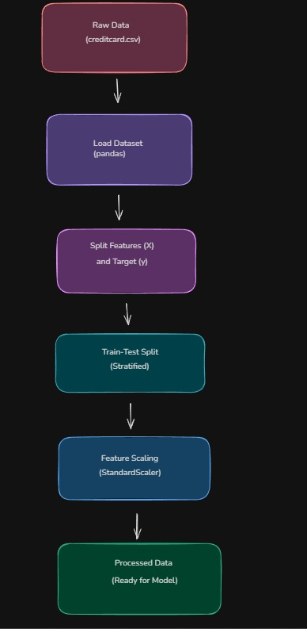

##  Data Preprocessing Pipeline

This pipeline converts raw transaction data into a format suitable for machine learning.

### Step 1: Data Loading
- Load dataset from CSV file into a dataframe

### Step 2: Feature & Target Separation
- Features (X): All columns except 'Class'
- Target (y): 'Class' column

### Step 3: Train-Test Split
- Split data into training and testing sets
- Use stratified sampling to maintain fraud ratio

### Step 4: Feature Scaling
- Apply StandardScaler to normalize feature values
- Important because features have different ranges

### Final Output:
- X_train, X_test
- y_train, y_test

## Pipeline Flow

